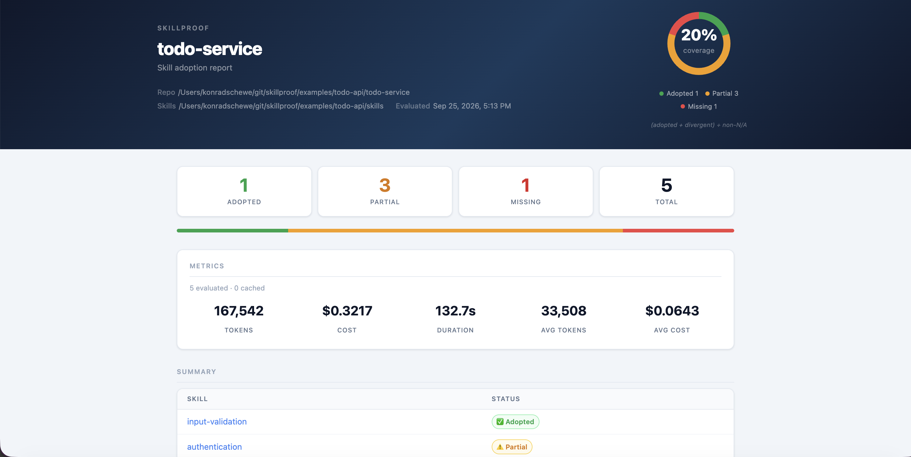

# Skillproof

**Prove that your codebase adopts the skills.**

Skillproof reads `SKILL.md` files and uses an LLM to verify whether your codebase actually implements the practices they describe — producing a structured report you can share with your team, run in CI, or publish to GitHub Pages.

---



---

## How it works

Teams distribute skills as `SKILL.md` files — plain markdown describing what a coding agent should implement: authentication patterns, error handling conventions, API integration requirements. Skillproof evaluates whether the codebase actually follows them.


Each skill gets a verdict: **adopted**, **divergent**, **partial**, or **missing**. The same skill that guides the coding agent during development becomes the specification for the conformance check — no separate test code required.

Run it locally before a code review, in CI on every push, or on a schedule to track adoption over time. Only skills that changed since the last run are re-evaluated.

→ [See a worked example](examples/todo-api/README.md)

---

## Use cases

**Enforce team standards** — A platform team distributes skills for authentication, error handling, or logging conventions. Every consumer team's coding agent implements them. Skillproof proves they're followed — and produces a report you can share with management or use as a compliance artifact.

**React to changing requirements** — When a provider updates a skill, run Skillproof to instantly see which implementations need to change. No manual auditing across repositories, no waiting for an incident to surface the gap.

**Track migration adoption** — Rolling out a new library, API version, or architectural pattern across multiple teams? Skillproof shows exactly which repositories have adopted it and which are still on the old implementation. A control mechanism for the team owning the migration.

**Gate CI on skill conformance** — Fail the build when required skills are missing or partially implemented. Use `--fail-on missing,partial` to enforce a minimum adoption level before merging.

---

## Installation

Run directly with npx (no install required):

```bash
npx @skillproof/cli --skills-dir ./skills
```

Or install globally:

```bash
npm install -g @skillproof/cli
```

---

## Quick start

```bash
export ANTHROPIC_API_KEY=your-api-key

skillproof \
  --skills-dir ./skills \
  --output-format markdown
```

---

## Options

All options can be set via CLI flags or a [config file](#config-file) (`--config`). CLI flags always take precedence.

| Flag | Config key | Type | Default | Description |
|---|---|---|---|---|
| `--config <path>` | — | string | — | Path to a JSON config file. All path values inside are resolved relative to the config file. |
| `--skills-dir <path>` | `skillsDir` | string | **required** | Directory containing `SKILL.md` files. Searched recursively. |
| `--repo-path <path>` | `repoPath` | string | `process.cwd()` | Repository to evaluate. |
| `--filter <substring>` | `filter` | string | — | Only evaluate skills whose name contains this substring. |
| `--provider <type>` | `provider` | `anthropic` \| `aicore` | `anthropic` | LLM provider. See [Providers](#providers). |
| `--system-prompt <text>` | `systemPrompt` | string | — | Appended to the evaluator's system prompt. Use to describe repo-specific context (e.g. "this is a shared library, not a concrete agent"). |
| `--strict` | `strict` | boolean | `false` | Require exact APIs and patterns as specified. Without `--strict`, functionally equivalent implementations are accepted as `adopted`. See [Adoption statuses](#adoption-statuses). |
| `--concurrency <n>` | `concurrency` | integer | `1` | Number of skills to evaluate in parallel. |
| `--cache-dir <path>` | `cacheDir` | string | `.skillproof-cache` | Directory for the evaluation cache. |
| `--no-cache` | `noCache` | boolean | `false` | Skip cache and force re-evaluation of all skills. Results are still saved. |
| `--output-format <fmt>` | `outputFormat` | `markdown` \| `github-summary` \| `json` \| `html` | `markdown` | See [Output formats](#output-formats). |
| `--output-file <path>` | `outputFile` | string | — | Write output to file instead of stdout. |
| `--fail-on <statuses>` | `failOn` | comma-separated | — | Exit with code `1` if any skill matches one of the given statuses. See [CI usage](#ci-usage). |
| `--verbose` | `verbose` | boolean | `false` | Stream agent reasoning and tool calls to stderr. |

---

## Config file

Pass `--config <path>` to load options from a JSON file. All path values are resolved relative to the config file's directory. CLI flags always override config values.

```json
{
  "skillsDir": "../skills",
  "repoPath": ".",
  "provider": "anthropic",
  "outputFormat": "markdown",
  "outputFile": "report.md",
  "concurrency": 5,
  "cacheDir": ".skillproof-cache",
  "noCache": false,
  "filter": "authentication",
  "systemPrompt": "This repository is a shared base library. Evaluate skills accordingly.",
  "strict": false,
  "failOn": "missing,partial"
}
```

---

## Providers

### Anthropic (default)

Uses `claude-sonnet` as evaluator and `claude-haiku` as explorer.

```bash
export ANTHROPIC_API_KEY=your-api-key
skillproof --provider anthropic --skills-dir ...
```

Optional: set `ANTHROPIC_BASE_URL` to override the API endpoint.

### SAP AI Core

Uses `anthropic--claude-4.6-sonnet` (evaluator) and `anthropic--claude-4.5-haiku` (explorer). These deployments must exist in your AI Core instance under the configured resource group.

```bash
export AICORE_SERVICE_KEY='{"clientid":"...","clientsecret":"...","url":"...","tokenurl":"..."}'
skillproof --provider aicore --skills-dir ...
```

`AICORE_SERVICE_KEY` must be the full service key JSON from BTP. Optionally set `AICORE_RESOURCE_GROUP` (defaults to `"default"`).

---

## Adoption statuses

Each skill is assigned one of five statuses:

| Status | Icon | Meaning |
|---|---|---|
| `adopted` | ✅ | The skill's requirements are clearly implemented. |
| `divergent` | 🔵 | All required behaviors are present but via a different API or pattern than the skill prescribes. |
| `partial` | ⚠️ | Some required behaviors are genuinely absent — not just implemented differently. |
| `missing` | ❌ | The skill's requirements are not implemented at all. |
| `not-applicable` | ➖ | The skill is intentionally irrelevant to this repository. |

**Strict mode** (`--strict`): `divergent` is no longer an acceptable outcome. The exact APIs and patterns described in the skill must be present. Without `--strict`, a functionally equivalent implementation counts as `adopted`, and only a complete-but-different implementation gets `divergent`.

---

## Output formats

### `markdown` (default)

A `# Skillproof Report` with a summary table, per-skill reasoning, and evidence (file paths / snippets). Also includes a metrics section (tokens, estimated cost, duration) for freshly evaluated skills.

### `github-summary`

Identical to `markdown`. When the env var `GITHUB_STEP_SUMMARY` is set (automatically in GitHub Actions), the report is additionally written to the Actions step summary.

### `json`

The raw evaluation report as JSON:

```json
{
  "repoPath": "...",
  "skillsDir": "...",
  "evaluatedAt": "2026-08-18T10:00:00.000Z",
  "results": [
    {
      "skillName": "authentication",
      "status": "partial",
      "reasoning": "...",
      "evidence": ["src/todos.ts"],
      "metrics": {
        "durationMs": 12300,
        "estimatedCostUsd": 0.0042,
        "evaluator": { "llmCalls": 2, "inputTokens": 5000, "outputTokens": 300, "cacheReadTokens": 0, "cacheWriteTokens": 0 },
        "explorer":  { "llmCalls": 3, "inputTokens": 8000, "outputTokens": 500, "cacheReadTokens": 0, "cacheWriteTokens": 0 }
      }
    }
  ]
}
```

### `html`

A rendered standalone HTML report with a summary dashboard, status cards, cost/token metrics, and a per-skill detail table. Suitable for publishing to GitHub Pages.

---

## CI usage

Use `--fail-on` to turn specific statuses into a non-zero exit code:

```bash
skillproof --skills-dir ... --fail-on missing,partial
```

Exit codes:

| Code | Condition |
|---|---|
| `0` | All skills evaluated; no `--fail-on` statuses matched. |
| `1` | A `--fail-on` status was matched, or an unrecoverable error occurred (missing `--skills-dir`, no `SKILL.md` files found, LLM error, etc.). |

Progress and per-skill metrics are always written to stderr, separate from the report output.

---

## Caching

Results are cached in `<cache-dir>/skillproof-cache.json` (default: `.skillproof-cache/skillproof-cache.json`).

A cached result is used when both of these match the previous run:
- **Skill hash** — content hash of the skill's directory
- **Repo hash** — HEAD commit SHA of the repository being evaluated

Use `--no-cache` to force re-evaluation regardless. Results are still saved to the cache after evaluation.

---

## GitHub Action

Use Skillproof in CI with the dedicated [skillproof-action](https://github.com/konradschewe/skillproof-action):

```yaml
- uses: actions/checkout@v4

- uses: konradschewe/skillproof-action@v1
  with:
    skills-dir: ./skills
    anthropic-api-key: ${{ secrets.ANTHROPIC_API_KEY }}
```

See [konradschewe/skillproof-action](https://github.com/konradschewe/skillproof-action) for all inputs, GitHub Pages publishing, and provider configuration.

### Full workflow example

```yaml
# .github/workflows/skillproof.yml
name: Skillproof

on:
  schedule:
    - cron: "0 6 * * 1"  # every Monday at 6am
  workflow_dispatch:

permissions:
  contents: write

jobs:
  skillproof:
    runs-on: ubuntu-latest
    steps:
      - uses: actions/checkout@v4

      - uses: konradschewe/skillproof-action@v1
        with:
          skills-dir: ./skills
          anthropic-api-key: ${{ secrets.ANTHROPIC_API_KEY }}
          concurrency: '5'
          fail-on: missing,partial
          publish-pages: true
```
